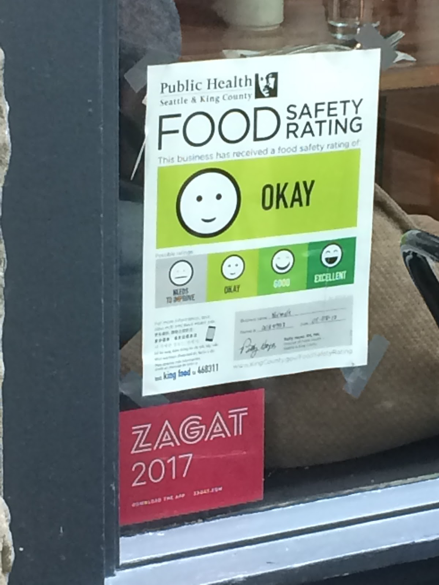

# 1. Introduction

The CDC estimates 48 million people get sick, 128,000 are hospitalized, and 3,000 die from foodborne diseases each year in the United States [(CDC)](https://www.cdc.gov/foodborneburden/estimates-overview.html). Many counties across the US try to spread awareness and incentivize food-service businesses to adhere to health codes by performing regular inspections and maintaining records of violations.

However, popular food review sites such as [Yelp](https://www.yelp.com/) do not publish these results for restaurants in my area (King County, WA), even when those restaurants have had several health violations in recent times. This leaves customers in the dark regarding food safety ratings until they arrive at the restaurant, assuming they see the printed 8.5 x 11 sign.

## 1.1 Breakdown of the Rating System
